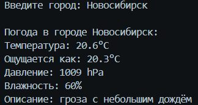

````markdown
# 🌤️ Weather App

Простое и элегантное консольное приложение для получения текущей погоды в любом городе мира.

## ✨ Особенности

- 📍 Получение погоды по названию города
- 🌡️ Температура в градусах Цельсия
- 💨 Ощущаемая температура, давление и влажность
- 🌍 Поддержка русскоязычных описаний погоды
- 🎨 Красивый и читаемый вывод

## 📸 Скриншоты

| Результат программы             |
| ------------------------ |
|  |

## 🚀 Установка и запуск

1. Убедитесь, что у вас установлен Go (версия 1.16 или выше)
2. Клонируйте репозиторий:

```bash
git clone https://github.com/Kirutka/Run-Boy-Run
cd Console-weather
```
````

2. Получите API ключ на [OpenWeatherMap](https://openweathermap.org/api)

3. Замените API ключ в файле `cmd//main.go`:

```go
apiKey := "ВАШ_API_КЛЮЧ"
```

3. Установите зависимости:

```bash
go mod init console-weather
go mod tidy
```

4. Запустите игру:

```bash
cd cmd
go run main.go
```

## 📦 Сборка

Для сборки исполняемого файла:

```bash
go build -o console-weather main.go
```

## 📦 Структура проекта

## 🎯 Использование

После запуска приложения просто введите название города:

```bash
Введите город: Москва

Погода в городе Москва:
Температура: 15.3°C
Ощущается как: 14.8°C
Давление: 1013 hPa
Влажность: 65%
Описание: легкая облачность
```

## 🛠️ Технологии

- **Go** 1.21+ - основной язык программирования
- **OpenWeatherMap API** - источник данных о погоде
- **Чистая архитектура** - разделение на слои

## 📄 Лицензия

Этот проект распространяется под лицензией MIT. Подробнее см. в файле LICENSE.md